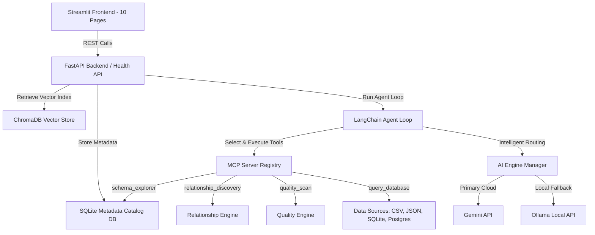

# DataMind AI
> **AI-Powered Data Catalog and Intelligence Copilot**

DataMind AI is an enterprise-ready metadata management platform that automatically crawls CSV, JSON, SQLite, and PostgreSQL sources to construct a searchable database catalog. It extracts schemas, computes statistical health profiles, maps table joins, generates business glossaries, and provides an interactive AI Copilot with local model failover, absolute PII data scrubbing, and SQL validation logic.

---

## 1. System Architecture



---

## 2. Key Features

- **Ingestion Pipeline Checklist**: Visual checklist tracing ingestion: Upload Complete, Schema Analysis, Column Discovery, Relationship Discovery, Metadata Extraction, Catalog Generation, Quality Analysis, Vector Build.
- **Auto-Flattening JSON Loader**: Automatically flattens complex nested dictionary lists, tracking paths with parent-child dot notation.
- **Relationship Discovery**: Calculates join overlap confidence based on column names and value intersection cardinality.
- **Data Quality Engine**: Evaluates null percentages, duplicates, format mismatches (emails/dates), numeric outliers (IQR), and orphaned child rows.
- **SQL Copilot**: Conversational Text-to-SQL builder. Validates generated statements against database schema catalogs before running queries.
- **Enterprise Privacy Mode**: Instantly skips Gemini calls to route all processes locally to Ollama (`llama3`).
- **PII Scrubbing Protection**: Identifies and masks contact fields and financial numbers, ensuring raw rows never escape.
- **Agent Monitor Tracing**: Observes agent loops (Intent, Planning, Tools, RAG Context, Validation).

---

## 3. Setup Guide

### Prerequisites
- Python 3.10 or higher installed.
- (Optional) [Ollama](https://ollama.com/) running locally with `llama3` downloaded (`ollama run llama3`).

### 1. Clone & Set Up Directory
Navigate to the directory and create a virtual environment:
```bash
python -m venv venv
venv\Scripts\activate
```

### 2. Install Dependencies
```bash
pip install -r requirements.txt
```

### 3. Configure Variables
Create a `.env` file from `.env.example` and set your key:
```ini
GEMINI_API_KEY=your_google_gemini_api_key
OLLAMA_HOST=http://localhost:11434
PRIVACY_MODE=false
```

---

## 4. How to Run

Concurrently launch both the FastAPI backend and Streamlit UI using:
```bash
python run.py
```
- FastAPI Backend: `http://127.0.0.1:8000`
- Health Endpoint: `http://127.0.0.1:8000/health`
- Streamlit Frontend: `http://localhost:8501`

To run automated test cases:
```bash
pytest tests/
```

---

## 5. Walkthrough Demo Script

1. **Boot Application**: Run `python run.py` and open the browser at `http://localhost:8501`.
2. **Access Settings**: Click the **⚙️ Settings** page in the sidebar.
3. **Upload CSV Catalog**: Upload `sample_data/customers.csv`. Click **Generate & Index Data Catalog**. Monitor completion ticks.
4. **Upload JSON Catalog**: Upload `sample_data/orders.json` to flat profile nested paths.
5. **Upload SQLite Database**: Upload `sample_data/transactions.db`.
6. **Navigate to Dashboard**: View total datasets (3), tables, health metrics, and coverage percentage.
7. **Drill Down in Explorer**: Go to **📁 Catalog Explorer**, choose `orders` and check types, PII mask states, and column business definitions.
8. **View Connections**: Inspect **🔗 Relationship Explorer** to trace links (`customers` joining `orders` on `customer_id`).
9. **Inspect Security**: Go to **🔒 Security Center**, enable **Enterprise Privacy Mode** to see Gemini failover routing.
10. **Q&A Chat**: Open **💬 AI Copilot** and ask: `"Which table contains customer emails?"`. Check model indicators and tools dispatched.
11. **Text-to-SQL**: Go to **💻 SQL Copilot** and query: `"Show orders amount grouped by customer city"`. Click execute to view aggregated data frame.
12. **Glossary & Traces**: View auto glossary records under **📖 Business Glossary** and audit LLM reasoning transitions under **🩺 Agent Monitor**.
